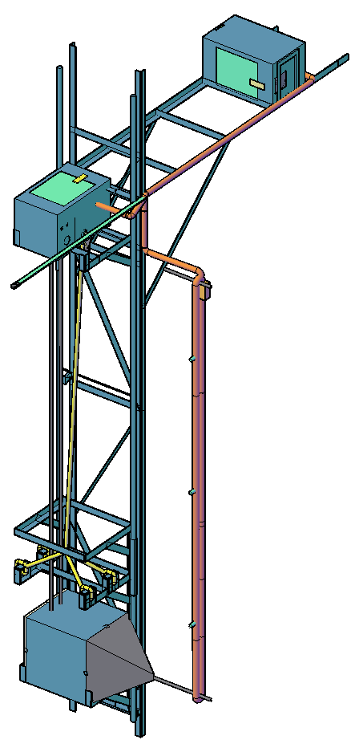
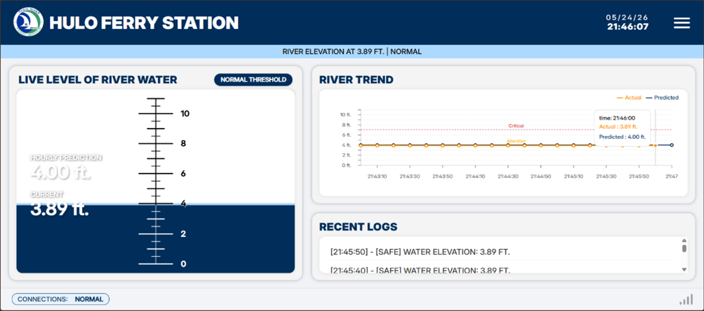
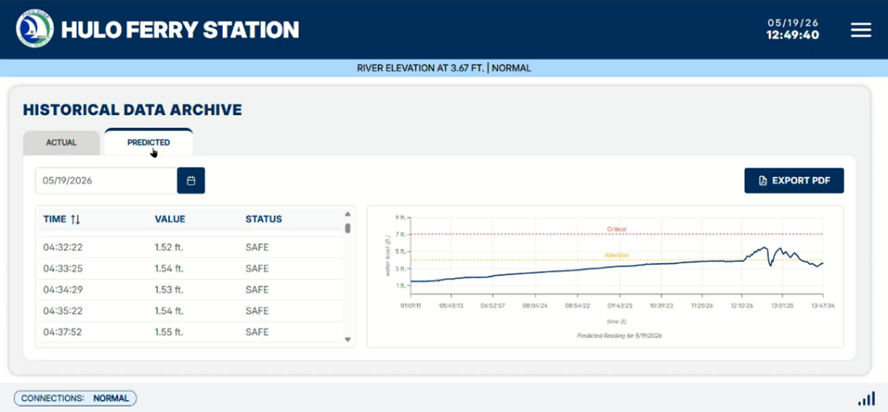

# 🌊 Hydroelectric-Powered River Water Level Monitoring with SMS Alerts for Hulo Ferry Station

> An automated, hybrid-powered IoT system designed to enhance disaster preparedness through real-time environmental tracking along the Pasig River (Hulo Reach).

## 🎯 Project Overview
Rising water levels in the Pasig River ecosystem often cause delayed announcements for ferry operations, affecting the safety and reliability of local transit. This project introduces a monitoring and prediction system to help ferry personnel and local officials make proactive safety decisions. By integrating a robust sensor array, the station continuously tracks river conditions, calculates water-level predictions, and dispatches automated SMS alerts when critical thresholds are breached.

## 🎥 Project Demonstration
| Prototype | Web Application |
| :---: | :---: |
|  |    |

*Click the image above to watch the system in action!* 

## ✨ Key Features
* **Dual Power Supply:** Combines a river-powered turbine and wall electricity for continuous battery charging.
* **Dual Microcontrollers:** Uses an ESP32 for sensor readings and a Raspberry Pi to host the website locally.
* **Dual Sensors:** Pairs ultrasonic sensors with backup float switches to ensure accurate water level readings.
* **Future Predictions:** Uses Linear and Quadratic Regression to forecast river levels.
* **Automated SMS Alerts:** Texts Ferry staff and local officials when water reaches unsafe thresholds.
* **Live Web Dashboard:** Allows users to view real-time data, past records, and adjust settings from any device.

## 📏 Water Level Thresholds
The system uses calibrated benchmarks, established using manual data from average low and high tide levels, to trigger SMS alerts:
* **Safe (0.00 FT - 4.00 FT):** Standard docking procedures and scheduled speeds.
* **Warning (4.01 FT - 7.05 FT):** Cautionary navigation required, awaiting instructions from authorities.
* **Critical (7.06 FT - 10.05 FT):** Suspend all transit and restrict riverbank access.

## 🛠️ Hardware Stack
* **Microcontrollers:** Raspberry Pi 4 Model B (4GB), ESP32-30P-CP2102
* **Sensors:** HC-SR04 Ultrasonic Sensor, MLE00578 Float Switch
* **Modules:** SIMCom A7670E GSM Module, DS3231 Real-Time Clock Module
* **Power Management:** Suzuki 12V Alternator, 50AH Lead-Acid Battery, XH-M603 Charge Controller, XH-M609 Low-Voltage Disconnect

## 💻 Tech Stack
* **Frontend:** React.js, HTML/CSS/JavaScript
* **Backend:** Flask, Python
* **Hardware & Sensors:** C++ (ESP32 Firmware)
* **System Config:** Shell/Bash (Raspberry Pi Configurations)
* **Database:** SQLite
* **Communication:** MQTT Protocol

## 👥 Authors & Researchers
Developed as a Bachelor of Science in Computer Engineering Capstone Project at **Rizal Technological University**
* [Aguilar](https://github.com/lompiromperu)
* [Armada](https://github.com/jannaarmada)
* [Barrosa](https://github.com/JuanitoBRosa)
* [Dela Cruz](https://github.com/youmademydawn)
* [Lorenzo](https://github.com/artoria911) 
* [Tagbo](https://github.com/winderuuu)

---
*Note: The system underwent evaluation based on ISO 25010:2023 standards and received "Strongly Satisfied" ratings across Functional Suitability, Performance Efficiency, Reliability, Interaction Capability, Maintainability, and Flexibility by Hulo Ferry Admin and Staff, Barangay Hulo Officials, and Technical Experts.*
